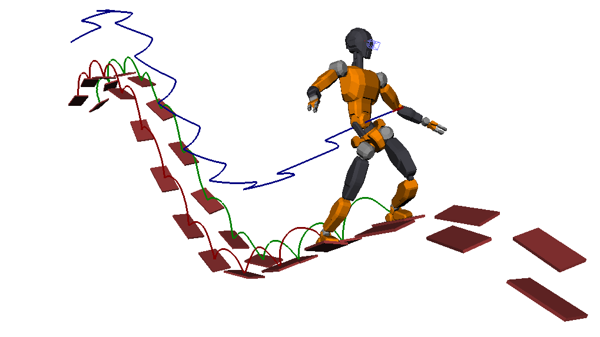

# TOPP-MPC

Source code for https://hal.archives-ouvertes.fr/hal-01363757

## Abstract

We present a Model-Predictive Controller (MPC) for multi-contact locomotion
where predictive optimizations are realized by Time-Optimal Path
Parameterization (TOPP). The key feature of this design is that, contrary to
existing planners where step timings are provided as inputs, here the timing
between contact switches is computed as output to a linear optimization problem
based on a dynamic model of the robot. This is particularly appealing to
multi-contact locomotion, where proper timings depend on the terrain topology
and suitable heuristics are unknown. Thanks to recent advances in multi-contact
stability computations, we improve the performance of TOPP for COM
trajectories, which allows us to integrate it into a fast control loop. We
implement the complete control pipeline and showcase it in simulations where a
model of the HRP-4 humanoid climbs up and down a series of hills. 

## Installation

On Ubuntu 14.04, you will need to [install
OpenRAVE](https://scaron.info/teaching/installing-openrave-on-ubuntu-14.04.html).
and [TOPP](https://github.com/quangounet/TOPP).

## Usage

Run the main script ``./walk.py``. Then, start simulations by typing
``sim.start()`` in the Python prompt.

To run simulations in stepping mode, you can use ``sim.step(n)`` with ``n`` the
number of steps. The state of all objects can be introspected using globals
``robot``, ``fsm`` (state machine), ``mpc`` (preview controller), etc.

### Note

Due to the copyright problem, we cannot release the COLLADA model ``HRP4R.dae``
used to produce the accompanying video and paper illustrations. It is replaced
at run time by
[JVRC-1](https://github.com/stephane-caron/openrave_models/tree/master/JVRC-1),
which has the same kinematic chain.

